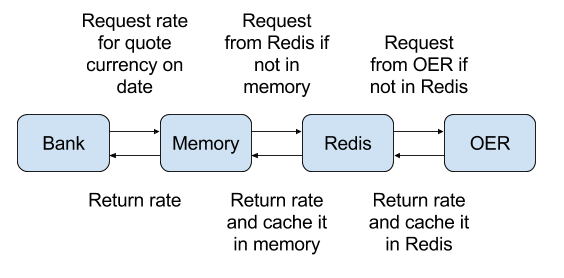

# historical-bank-ruby

## Description

This gem provides a bank that can serve historical rates,
contrary to most bank implementations that provide only current market rates.
[Open Exchange Rates](https://openexchangerates.org/) (OER) is used as the provider of the rates and an Enterprise or Unlimited plan is required.
As the HTTP requests to OER can add latency to your calls, a `RatesStore` (cache) based on Redis was added, making it super-fast.

You can use it as your default bank and keep calling the standard `money` gem methods (`Money#exchange_to`, `Bank#exchange_with`). On top of that, we've added a few more methods that allow accessing historical rates (`Money#exchange_to_historical`, `Bank#exchange_with_historical`).


### Base currency

An **exchange rate** has a **base currency** and a **quote (or counter) currency**.
More specifically, it is the price of 1 unit of base currency in the quote currency.
For example, if base currency is EUR, quote currency is USD, and the rate is 1.25,
this means that 1 EUR is equal to 1.25 USD.

All the rates fetched and cached by this `Bank` are relative to a single base currency which is defined in the configuration block.
This helps to optimize fetching and caching rates.

Default base currency is EUR, but it can be changed in the config.


### Dates, times, timezones

The timezone used throughout this gem is the UTC timezone.

All processed rates (fetched from OER, added manually, cached in Redis) are considered to be the [closing (end of day) rates](https://openexchangerates.org/faq/#eod-values) for their associated dates in UTC.
For example, when we have a cached rate of EUR->USD on January 10th 2017 with value 1.25,
this means that 1 EUR was equivalent to 1.25 USD on January 10th at 23:59:59.
This is the historical rate that the bank will use for exchanging EUR with USD on that date.
Consequently, a rate for a certain `date` fetched from OER becomes available at 00:00 UTC on `date+1`.

For convenience, methods that accept `Date`s as arguments can accept `Time`s as well.
When a `Time` is used, it is first converted into the UTC-equivalent `Date`,
and method is executed as if that `Date` was passed instead.
For example, when the `Time` `2017-01-10 02:50:00 +04:00` is passed as argument to `#exchange_with_historical`,

```ruby
from_money = Money.new(100_00, 'EUR')
to_currency = 'USD'

# 2017-01-10 02:50:00 +0400
bank.exchange_with_historical(from_money, to_currency, Time.new(2017, 1, 10, 2, 50, 0, '+04:00'))
# => #<Money fractional:10585 currency:USD>
```

it is equivalent to passing the `Date` `2017-01-09`

```ruby
# 2017-01-09
bank.exchange_with_historical(from_money, to_currency, Date.new(2017, 1, 9))
# => #<Money fractional:10585 currency:USD>
```


### Caching

We've implemented 2 layers of caching in order to obliterate latency!
First layer is memory (instance variable in the bank object), and second is Redis.
If desired rate is not found in memory, the bank tries to look it up in Redis.
If that fails too, a request to OER is made.

When we fetch rates from OER, they are cached in Redis and memory too.
Similarly, when the rate is found in Redis, it is again cached in memory.

<p align="center">
  
</p>

Pretty simple and fast!


### Singleton

The bank follows the Singleton pattern, as it inherits from `money` gem's `Money::Bank::Base`.
This also helps preserve the memory cache across calls.
Don't worry, the bank is thread-safe!


## Requirements

- **OpenExchangeRates Enterprise or Unlimited plan** - It is needed for calling the `/time-series.json` endpoint which serves historical rates.
- **Redis >= 2.8** (versions of Redis earlier than 2.8 may also work fine, but this gem has only been tested with 2.8 and above.)
- **Ruby >= 2.0**


## Installation

```
gem install historical-bank
```

Alternatively, if you're using `bundler`, you can add
``` ruby
gem 'historical-bank'
```
to your `Gemfile` and run `bundle install`


## Usage

Example scripts demonstrating all functionality can be found in [`examples/`](examples/).

### Configuration

```ruby
Money::Bank::Historical.configure do |config|
  # (required) your OpenExchangeRates App ID
  config.oer_app_id = 'XXXXXXXXXXXXXXX'

  # (optional) currency relative to which all the rates are stored (default: EUR)
  config.base_currency = Money::Currency.new('USD')

  # (optional) the URL of the Redis server (default: 'redis://localhost:6379')
  config.redis_url = 'redis://localhost:6379'

  # (optional) Redis namespace to prefix all keys (default: 'currency')
  config.redis_namespace = 'currency_historical_gem'

  # (optional) set a timeout for the OER calls (default: 15 seconds)
  config.timeout = 20
end
```

#### Rails

In Rails, config should be set inside an initializer (`config/initializers`).
If you have the `money-rails` gem installed, you can add this on top of the `config/initializers/money.rb` file.

```ruby
# config/initializers/money.rb

require 'money/bank/historical'

Money::Bank::Historical.configure do |config|
  # ....
end


MoneyRails.configure do |config|
  # ...

  # if you want to set it as the default bank
  config.default_bank = Money::Bank::Historical.instance

  # ...
end
```

#### Sinatra

In a Sinatra app (or any other kind of app), simply set the config before you call `Money::Bank::Historical.instance`.

```ruby
# app.rb

require 'money/bank/historical'

Money::Bank::Historical.configure do |config|
  # ....
end

class App < Sinatra::Base

  configure do
    # if you want to set it as the default bank
    Money.default_bank = Money::Bank::Historical.instance
  end

  # ...
end
```

### Dates

The minimum date for which we can fetch rates is January 1st 1999.
This [limitation](https://docs.openexchangerates.org/docs/api-introduction) is set by the OpenExchangeRates API.
The maximum date for which we fetch OER rates is yesterday (in UTC),
as [today's rates are not yet final](https://openexchangerates.org/faq/#timezone).

However, if you want to overcome these limitations manually, you can add past (and even future!) rates using `Historical#add_rate` and `#add_rates`.

### Exchange

You can use the bank object for the exchange
```ruby
from_money = Money.new(100_00, 'EUR')
to_currency = 'GBP'

bank = Money::Bank::Historical.instance

# exchange money with rates from December 10th 2016
bank.exchange_with_historical(from_money, to_currency, Date.new(2016, 12, 10))
# => #<Money fractional:8399 currency:GBP>

# can also pass a Time/DateTime object, it's converted into the respective UTC Date
bank.exchange_with_historical(from_money, to_currency, Time.utc(2016, 10, 2, 11, 0, 0))
# => #<Money fractional:8691 currency:GBP>
```

Or perform it directly on the `Money` object
```ruby
from_money.exchange_to_historical(to_currency, Date.new(2016, 12, 10))
# => #<Money fractional:8399 currency:GBP>
```

`Bank#exchange_with` and `Money#exchange_to` can still be used. In this case, recent rates are needed, so yesterday's closing rates are used for the calculation
```ruby
bank.exchange_with(from_money, to_currency)

# set the default bank and create a new Money object that will use it
Money.default_bank = Money::Bank::Historical.instance
from_money = Money.new(100_00, 'EUR')
from_money.exchange_to(to_currency)
```

### Adding and retrieving rates

Adding rates will not be needed in most cases as the rates are fetched from OER.
However, `#add_rate` and `#get_rate` were implemented in order to conform to the Bank API.
An extra `#add_rates` method was implemented for setting rates in bulk.

`#add_rate` and `add_rates` can prove quite when **testing**,
as you can't afford HTTP requests there.
Only thing you need to do is initialize the bank, and add some default rates
before your tests run.


#### Get single rate

`#get_rate` accepts both ISO strings and Money::Currency objects
```ruby
bank.get_rate(Money::Currency.new('GBP'), 'CAD', Date.new(2016, 10, 1))
# => #<BigDecimal:7fd39fd2cb78,'0.1703941289 451827243E1',27(45)>
```

Getting without a datetime will return yesterday's closing rate, e.g. `bank.get_rate('CAD', 'CNY')`.

#### Add single rate

`#add_rate` adds a single rate to the Redis cache. It accepts both ISO strings and `Money::Currency` objects. Added rates should be relative to the base currency.
```ruby
date = Date.new(2016, 5, 18)

bank.add_rate('EUR', 'USD', 1.2, date)
bank.add_rate(Money::Currency.new('USD'), Money::Currency.new('GBP'), 0.8, date)

# 100 EUR = 100 * 1.2 USD = 100 * 1.2 * 0.8 GBP = 96 GBP
bank.exchange_with_historical(from_money, to_currency, date)
# => #<Money fractional:9600 currency:GBP>
```

Adding without a datetime will set the rate to yesterday's closing rate
```ruby
bank.add_rate('EUR', 'USD', 1.4)
bank.add_rate(Money::Currency.new('USD'), Money::Currency.new('GBP'), 0.6)

# 100 EUR = 100 * 1.4 USD = 100 * 1.4 * 0.6 GBP = 84 GBP
bank.exchange_with(from_money, to_currency)
# => #<Money fractional:8400 currency:GBP>
```

Trying to add a rate that is not relative to the base currency will fail.
This is because all cached rates are relative to the base currency.
```ruby
bank.add_rate('EUR', 'GBP', 0.96, date)
# ArgumentError: `from_currency` (EUR) or `to_currency` (GBP) should match the base currency USD
```

#### Add rates in bulk

`#add_rates` can be used to add multiple historical rates (relative to the base currency) to the Redis cache.
```ruby
rates = {
  'EUR' => {
    '2015-09-10' => 0.11, # 1 USD = 0.11 EUR
    '2015-09-11' => 0.22
  },
  'GBP' => {
    '2015-09-10' => 0.44, # 1 USD = 0.44 GBP
    '2015-09-11' => 0.55
  }
}
bank.add_rates(rates)

# 100 EUR = 100 / 0.11 USD = 100 / 0.11 * 0.44 GBP = 400 GBP
bank.exchange_with_historical(from_money, to_currency, Date.new(2015, 9, 10))
# => #<Money fractional:40000 currency:GBP>
```
